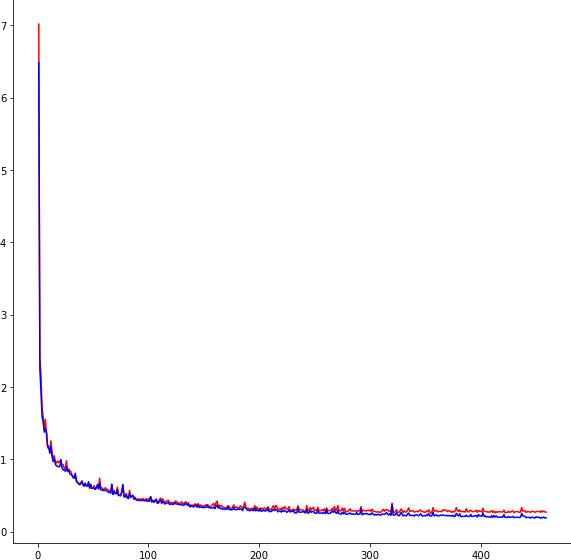
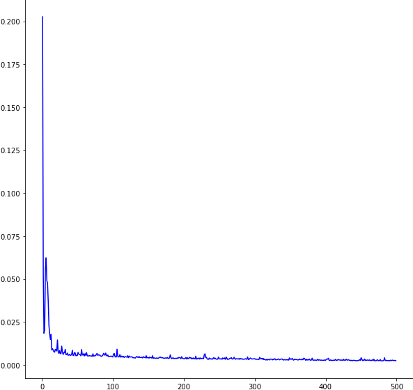

# supervisedDL-SRVFdistances
A supervised DL framework for computing pairwise SRV elastic shape distances between curves as defined in *Supervised deep learning of elastic SRV distances on the shape space of curves*. Includeds functions to define a Keras model and train the model with shape preserving data augmentation. 

# References

```
@misc{DL-SRVF,
  author  = {Emmanuel Hartman, Yashil Sukurdeep, Nicolas Charon, Eric Klassen, and Martin Bauer},
  title   = {Supervised deep learning of elastic SRV distances on the shape space of curves},
  note    = {Preprint available on ArXiv soon},
  year    = {2021},
}
```
Please cite this paper in your work.

# Requirements

Our code is written in Python and includes the following Python libraries:

  -Numpy

  -Scipy

  -TensorFlow

  -Keras

# Usage

A Jupyter Notebook called *Examples.ipynb* has been included with examples of usage of our main functions. This covers our functions that declare a Keras model with the structure outlined in *Supervised deep learning of elastic SRV distances on the shape space of curves*, train the network using shape preserving data augmentation, and generate random curves from the same shape class as another curve. Further, in the Jupyter Notebook called *TrainedNetworks.ipynb* we outline how to use one of our pretrained networks (include in the Data folder) to compute a distance between two curves. 


# Trained Networks

In the data folder we include two networks, defined and trained in our framework. The first, called *Model_Synthetic1.h5* is trained on open, real valued functions discretized at 90 points from our Synthetic I data set. Model_Synthetic1 was trained for 500 epochs with parameters trainsize=10000 and reparamn=10. We plot the mean squared error of this model on the training data as well as on unseen testing data. The second, called *Model_Kimia.h5* is trained on closed, 2-dimensional curves discretized at 100 points from the Kimia dataset. Model_Kimia was trained for 50 epochs with parameters trainsize=10000 and reparamn=10.

| |
|:--:| 
| *Mean Squared Error of the network on training data (blue) and testing data (red)* |
| *The x-axis represents the number of training iterations* |
# Main Functions
**defineModel(length, dim, closed, verbose=True)**

    Parameters
    ----------
    length : int
        length of the curves the model
    dim : int
        dimension of the curves
    closed : bool
        whether or not curves are closed
    verbose : bool
        whether or not to display model summary
        
    Returns        
    ----------
    model: keras model
        new model with layers as defined in 
        *Supervised deep learning of elastic SRV distances on the shape space of curves*

**trainModelwSPDA(model, length, dim, closed, otrData, otrLabels, e, trainsize=None, reparamn=10, verbose=True)**

    Parameters
    ----------
    model : keras model
        keras model to be trained, can be custom or created with with defineModel
    length : int
        length of the curves for training 
    dim : int
        dimension of the curves
    closed : bool
        whether or not curves are closed
    otrData : numpy array
        np array with pairs of curves   
    otrLabels : numpy array
        the precise distances computed for each case in otrData
    trainsize : int
        batchsize for each epoch of training
    reparamn : int
        number of curves to generate from each shape class during shape preserving data augmentation
    verbose : bool
        whether or not to display training progress
        
    Returns        
    ----------
    model: keras model
        trained model
        

**trainAndValidateModelwSPDA(model, length, dim, closed, otrData, otrLabels, tData, tLabels, e, trainsize, reparamn=10)**

    Parameters
    ----------
    model : keras model
        keras model to be trained, can be custom or created with with defineModel
    length : int
        length of the curves for training 
    dim : int
        dimension of the curves
    closed : bool
        whether or not curves are closed
    otrData : numpy array
        np array with pairs of curves for training
    otrLabels : numpy array
        the precise distances computed for each case in otrData used as labels for training
    tData : numpy array
        np array with pairs of curves for testing/validation
    tLabels : numpy array
        the precise distances computed for each case in tData for testing/validation
    trainsize : int
        batchsize for each epoch of training
    reparamn : int
        number of curves to generate from each shape class during shape preserving data augmentation
    verbose : bool
        whether or not to display training progress
        
    Returns        
    ----------
    model: keras model
        trained model
    trainMSE: numpy array
        mean squared error for otrData at each epoch
    testMSE: numpy array
        mean squared error for tData at each epoch
        
**randomCurveFromShapeClass(f1, newlength, d, closed)**

    Parameters
    ----------
    f1 : numpy array
        curve to get the shape class of
    newlength : int
        desired length for the returned curve
    d : int
        dimension of the curves
    closed : bool
        whether or not f1 is closed
        
    Returns        
    ----------
    f : numpy array
        curve discretized at newlength points from the same shape class as f1
        
**getShapeClass(f1, d)**

    Parameters
    ----------
    f1 : numpy array
        curve to get the shape class of
    d : int
        dimension of the curves
        
    Returns        
    ----------
    f : numpy array
        trimmed array representing the shape class of f1
#License

You may redistribute and/or modify this code under the terms of the GNU General Public License as published by the Free Software Foundation.

This program is distributed in the hope that it will be useful, but WITHOUT ANY WARRANTY; without even the implied warranty of MERCHANTABILITY or FITNESS FOR A PARTICULAR PURPOSE. See the GNU General Public License for more details.

You should have received a copy of the GNU General Public License along with this program. If not, see http://www.gnu.org/licenses/.

# Contact

elh18e(at)my.fsu.edu
